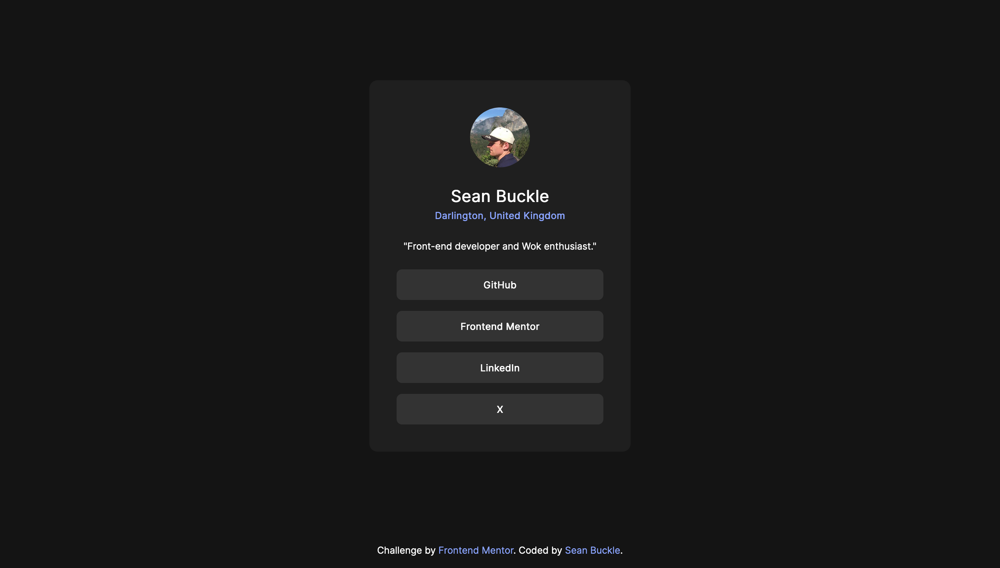

# Frontend Mentor - Social links profile solution

This is a solution to the [Social links profile challenge on Frontend Mentor](https://www.frontendmentor.io/challenges/social-links-profile-UG32l9m6dQ). Frontend Mentor challenges help you improve your coding skills by building realistic projects.

## Table of contents

- [Overview](#overview)
  - [The challenge](#the-challenge)
  - [Screenshot](#screenshot)
  - [Links](#links)
- [My process](#my-process)
  - [Built with](#built-with)
- [Author](#author)

## Overview

### The challenge

Users should be able to:

- See hover and focus states for all interactive elements on the page

### Screenshot

### Links

- Solution URL: [https://github.com/seanbuckle/social-links-profile](https://github.com/seanbuckle/social-links-profile)
- Live Site URL: [https://seanbuckle.github.io/social-links-profile/](https://seanbuckle.github.io/social-links-profile/)

## My process

### Built with

- [Semantic HTML5 markup](https://www.w3schools.com/html/html5_semantic_elements.asp) - For HTML
- [CSS custom properties](https://developer.mozilla.org/en-US/docs/Web/CSS/Using_CSS_custom_properties) - For styles
- [Flexbox](https://css-tricks.com/snippets/css/a-guide-to-flexbox/)
- [CSS Grid](https://css-tricks.com/snippets/css/complete-guide-grid/)
- [Mobile-first workflow](https://www.w3schools.com/howto/howto_css_mobile_first.asp) - For responsiveness
- [SASS/SCSS](https://sass-lang.com/) - For styles

## Author

- Github - [@seanbuckle](https://www.github.com/seanbuckle)
- Frontend Mentor - [@seanbuckle](https://www.frontendmentor.io/profile/seanbuckle)
- X - [@seanlbuckle](https://www.twitter.com/seanlbuckle)
- LinkedIn - [@seanbuckle](https://www.linkedin.com/in/seanbuckle/)
